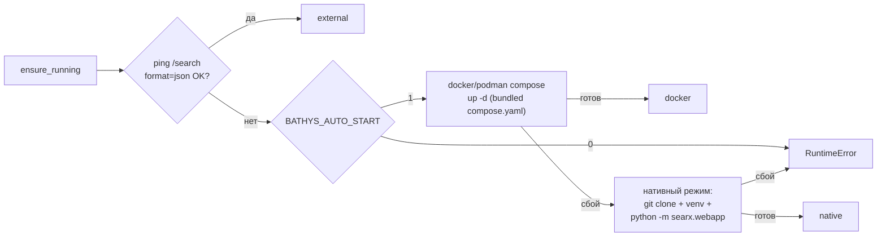

# ADR 0003 — Self-managed SearXNG: единый механизм обеспечения бэкенда

| Поле | Значение |
|---|---|
| Статус | Accepted |
| Дата | 2026-09-06 |
| Применимо к | Bathys v0.1.0 |
| Затрагивает | `src/bathys/services.py`, `src/bathys/compose.yaml`, `src/bathys/searxng-settings.yml`, `src/bathys/config.py` |

## Context

SearXNG — обязательная зависимость (`searx.py` требует JSON API на `/search`), но это не pip-пакет: его надо где-то запустить. Bathys — локальный сервер «поставил и работает», поэтому требовать от пользователя ручной подъём инфраструктуры нельзя, а среды деплоя разнородны: хост с docker, plain VPS/CI без контейнеров вообще.

## Decision

Сервер сам обеспечивает бэкенд (`ensure_running` в `services.py`, лениво при первом поиске, повторные вызовы идемпотентны). Порядок попыток:

1. **External** — уже отвечающий инстанс на `BATHYS_SEARXNG_URL`: Bathys его только использует.
2. **Docker** — первый найденный движок из `docker compose`, `podman compose`, `docker-compose`, `podman-compose`; `up -d` с bundled `compose.yaml` (порт `127.0.0.1:8888→8080`, `cap_drop: [ALL]`, настройки из bundled `searxng-settings.yml`: JSON включён, limiter off, bind `127.0.0.1`).
3. **Native** — для сред без контейнеров: `git clone --depth 1` SearXNG + venv под `BATHYS_SEARXNG_HOME`; venv без `ensurepip` поднимается через `--without-pip` + `get-pip.py` (закладка на минимальные debian-образы); установка `requirements.txt` маркируется `.searxng-reqs-done`; дочерний процесс `python -m searx.webapp` с `SEARXNG_SETTINGS_PATH`, логи — в файл `searxng.log` (не в stdout).

Режим форсируется `BATHYS_START_MODE=docker|native`; готовность опрашивается до `startup_timeout` секунд. Ошибка любой попытки не прерывает цепочку — собирается в итоговый `RuntimeError`.

## Alternatives

| Альтернатива | Почему отклонена |
|---|---|
| Требовать ручной docker | барьер деплоя: ломает контракт «локальный сервер из коробки» |
| Встроить SearXNG в процесс | SearXNG — не pip-пакет; внутрь процесса не взять |
| Публичные инстансы SearXNG | у них отключён JSON API — контракт `searx.py` не выполняется |

## Consequences

- Положительные: один путь кода покрывает все среды; дочерний SearXNG не засоряет stdio MCP; `stop_native()` в `Engine.stop()` гарантирует завершение потомка вместе с сервером.
- Нейтральные: жизненный цикл потомка принадлежит процессу Engine (см. `module-contracts.md`); идемпотентность обеспечивают marker-файлы (`venv/bin/pip`, `.searxng-reqs-done`) и декларативность `compose up -d`.
- Риски (приняты, план v0.2): supply-chain — клонируется ветка `master`, образ в `compose.yaml` — `searxng/searxng:latest`; в v0.2 запинить тег/дайджест. Экспозиция — только `127.0.0.1`; статический `secret_key` в bundled-настройках допустим при localhost-only и подлежит ротации при любом выходе за localhost.

## Источники

`src/bathys/services.py`; `src/bathys/compose.yaml`; `src/bathys/searxng-settings.yml`; `src/bathys/core.py` (`_backend`).
