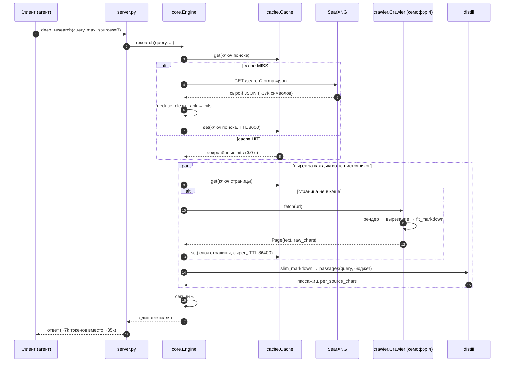
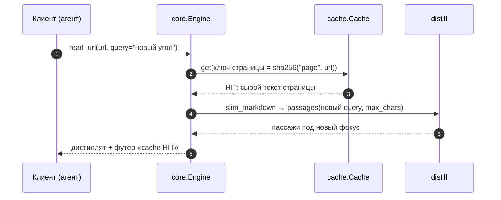

# Потоки данных

Диаграммы показывают два главных пути: полный конвейер `deep_research` и кэш-HIT путь `read_url`. Компоненты и их ответственность — в [overview.md](overview.md); стадии очистки — в [pipeline.md](pipeline.md).

## deep_research: полный путь

Детали, которых не видно на диаграмме:

- **Семофор 4** ограничивает параллельные нырки — топ-6 источников читаются не более чем четырьмя браузерными сессиями одновременно.
- **Ошибка одной страницы не валит вызов**: секция отмечается `(not fetched — …)` и дополняется сниппетом из выдачи.
- **Ответ**(instant answer) SearXNG, если есть, поднимается перед секциями; запасные хиты идут в блок «More hits (not fetched)» — не больше пяти ссылок.
- **Футер** `[bathys: …]` подводит итог: сколько хитов найдено, сколько страниц проныряно, «сырьё → ответ» в токенах и время. Контракт форматов — `docs/contracts/output-format.md`.

## read_url: кэш-HIT путь

Второе чтение той же страницы под другим `query` — самый частый «бесплатный» случай:

Сеть и браузер не участвуют вовсе: сырец лежит в кэше **до** дистилляции, поэтому новая фокусировка стоит только локального пересчёта BM25. Если вместо текста в кэше лежит ошибка загрузки (её тоже кэшируем на час), `read_url` вернёт её как есть — повторный заход не дёргает мёртвый URL.
