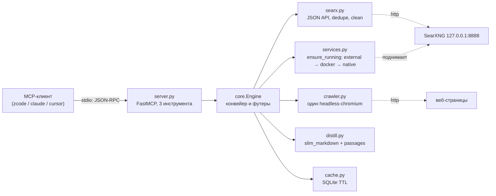

# Архитектура Bathys: обзор

Bathys — один локальный процесс: MCP-обвязка поверх конвейера «поиск → нырёк → дистилляция» с общим кэшем. Проект сознательно фреймворк-фри (`core.py` управляется и без MCP-обёртки — этим пользуются `scripts/smoke.py` и тесты). Границы и принципы — в [charter.md](../product/charter.md); здесь — устройство.

## Компоненты

Потоки данных по шагам — в [data-flow.md](data-flow.md); конвейер очистки внутри `crawler.py` + `distill.py` — в [pipeline.md](pipeline.md).

## Ответственность модулей

`src/bathys/` — восемь модулей и два файла данных (`compose.yaml`, `searxng-settings.yml`):

| Модуль | Отвечает за |
|---|---|
| `server.py` | объявляет три MCP-инструмента, держит `Engine` в lifespan, уводит чужие логи с stdout |
| `core.py` | ведёт конвейер: `research` / `search` / `read`, кэш-ключи, клампинг аргументов, футеры |
| `config.py` | читает 12 env-переменных с дефолтами в frozen-датакласс `Config` |
| `services.py` | обеспечивает живой SearXNG: пинг, автостарт external → docker → native, класс `_Native` |
| `searx.py` | клиент SearXNG: `clean_text`, `normalize_url` (срез utm), дедупликация, ранжирование по score |
| `crawler.py` | держит общий headless-chromium, выполняет нырёк: рендер, вырезание мусора, `fit_markdown` |
| `distill.py` | чистит markdown, чанкует текст, отбирает BM25-пассажи под запрос, соблюдает бюджет |
| `cache.py` | хранит поиски и страницы в SQLite с TTL; ключ — sha256 от набора аргументов |

## Сквозные инварианты

1. **Чистота stdout.** MCP stdio владеет stdout: `server.py` переносит лог-хендлеры библиотек на stderr, нативный SearXNG пишет в файл `searxng.log` — в протокол не попадает ничего лишнего.
2. **Бюджеты соблюдаются точно.** Аргументы клампятся (`read_url` 300–50000, `per_source` 300–8000, `max_sources` 1–6, `max_results` 1–20), а `distill.passages()` возвращает не больше бюджета символов, даже если ради этого режет последний чанк.
3. **Кэш хранит сырец до дистилляции.** В SQLite ложится текст страницы после `fit_markdown`, но до `passages()`; поэтому перечитать её под другим запросом — бесплатно и без сети.
4. **Автостарт идемпотентен.** Перед стартом бэкенд пингуется; отвечающий инстанс (`external`) не пересоздаётся; `_Native` — синглтон на процесс, установка зависимостей помечается файлом-маркером, docker-старт — `compose up -d` с фиксированным `container_name`.
