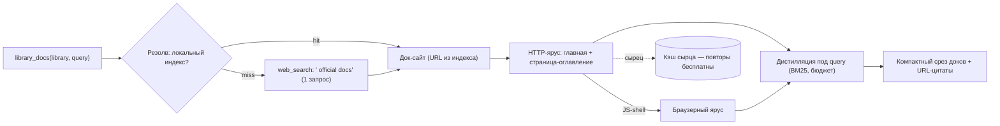

# Инициатива: library_docs — «Context7, но локально и без лимитов»

| Поле | Значение |
|---|---|
| Статус | Утверждена владельцем 2026-09-14 («важная задача — добавить функциональность Context7: актуальная документация по коду, бесплатно, без лимитов запросов»); разведка проведена живьём через Bathys |
| Источник-референс | [Context7](https://github.com/upstash/context7) (62k★, Upstash): MCP-инструменты `resolve-library-id` + `query-docs`; **parsing/crawling-движки приватные** (в репо только обёртка); free-tier урезан до ~1000 запросов/мес (январь 2026); офлайн-режима нет |
| Принцип | Источники доков открыты сами по себе (официальные сайты, GitHub-репозитории). Пайплайн Bathys уже содержит «parsing engine» Context7: двухъярусное извлечение + BM25-дистилляция + кэш сырца. Недостаёт только резолв имени → источник. Никаких API-ключей, никаких лимитов, повторные запросы бесплатны (кэш). |

## Архитектура

- **Резолв**: (1) seed-индекс популярных библиотек (JSON в пакете, `src/bathys/docs_index.json`); (2) fallback — один живой `web_search` через SearXNG («{library} official documentation»); (3) GitHub-паттерн `github.com/{library}` если похож на slug.
- **Извлечение**: существующие ярусы. Доксайты часто JS-ные (docusaurus/vitepress) — браузерный ярус их берёт; статические (mkdocs/sphinx/readthedocs) — HTTP-ярус за миллисекунды.
- **Дистилляция**: существующий `passages()` под query — то самое «компактный срез, который не раздувает счёт за токены».
- **Кэш сырца**: существующий; повторный вопрос по той же библиотеке = 0 сети, мгновенно, **без лимитов** — то, чего нет у Context7.
- Версионность (фаза 2): `{version}` → GitHub-тег репозитория (`raw.githubusercontent.com/{owner}/{repo}/v{N}/docs/…`).

## Отличия от Context7 (честная таблица)

| Ось | Context7 | Bathys library_docs |
|---|---|---|
| Цена | free ~1000 req/мес, Pro $7 | без лимитов (кэш + живой поиск бесплатны) |
| Офлайн | нет | да, после первого чтения (кэш сырца) |
| Индекс | их закрытая база | seed-индекс + живой поиск: любой сайт доков, даже не в базе |
| Parsing engine | приватный | наш открытый (двухъярусный) |
| Дистилляция | их 5-стадийный конвейер | наш BM25 + бюджеты |
| Свежесть | их цикл обновления | «из первых рук» при каждом cache-miss |

## Фазы

- **Фаза 1** (текущая): инструмент `library_docs(library, query)`; seed-индекс ~20 топ-библиотек; резолв через индекс→поиск; извлечение главной+подстраниц; дистилляция; кэш.
- **Фаза 2**: версионность (GitHub-теги); догрузка релевантных подстраниц (не только главная); `docs`-категория поиска SearXNG для резолва.
- **Фаза 3**: seed-индекс расширяется автоматически (успешные резолвы пишутся в пользовательский индекс).