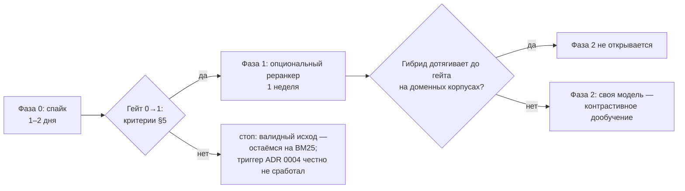

# Инициатива: лёгкий семантический слой (re-ranker)

| Поле | Значение |
|---|---|
| Статус | Спайк проведён 2026-09-06 — **гейт качества не пройден**, остаёмся на BM25 (см. «Результаты спайка» в конце); повторный спайк — после сбора реального eval-набора |
| Дата | 2026-09-06 |
| Мейнтейнер | единственный |
| База-кандидаты | ONNX-эмбеддеры лёгкого класса: `multilingual-e5-small` (база), `snowflake-arctic-embed-m-v2.0`, `bge-m3` (потолок) |
| Рантайм | `onnxruntime` + `tokenizers`, без torch |
| Смежные документы | [charter.md](charter.md) · [roadmap.md](roadmap.md) · [features.md](features.md) · [ADR 0004](../adr/0004-bm25-distillation.md) · [ocr-initiative.md](ocr-initiative.md) (§2 — рамка кодека) |

## 1. Зачем: точность отбора, не сжатие

BM25 — лексический ранжир: он сопоставляет термы, а не смыслы. Парафразы и
синонимы проходят мимо: запрос «как ускорить рендер» не совпадает лексически со
страницей «оптимизация paint», хотя смысл тот же. Тем временем отбор пассажей в
`web_search`, `read_url` и `deep_research` идёт в фиксированном бюджете символов:
каждый мусорный пассаж, влезший в бюджет, вытесняет полезный и доезжает до
контекста вызывающей модели как мёртвые токены.

Эмбеддер-переранжирование добавляет к лексическому скору семантический: пассажи,
близкие запросу по смыслу, поднимаются внутри того же бюджета. Эффект — выше
точность ОТБОРА, меньше мусорных токенов в контексте при неизменном размере
бюджета.

Честная фиксация границ: модель растит **точность отбора**, а не **сжатие**.
Сжатие (главная метрика хартии) уже 97%+ и эмбеддером не двигается — двигается
качество того, что остаётся внутри сжатого. Поиск сам по себе уже локальный и
безмодельный (SearXNG + BM25): модель не участвует в поиске, только в отборе из
уже найденного.

JTBD-кандидат: «Когда BM25 отбирает пассажи по лексике, я хочу, чтобы внутри
бюджета выживали смысловые совпадения, чтобы контекст агента не забивался
мусорными токенами».

## 2. Рамка: ранжир, не синтез

Рамка та же, что для OCR ([§2 ocr-initiative](ocr-initiative.md)): модель
трактуется как детерминированный кодек, а не собеседник.

- **Синтез — нет.** Ранжирование — детерминированная обработка: cosine между
  готовыми векторами, без декодинга, генерации и свободы ответа. ADR 0004 не
  трогается: дистилляция остаётся без моделей, эмбеддер стоит рядом с BM25 как
  второй скор.
- **Узкий опциональный плагин — да.** Extra `[mind]`: веса и `onnxruntime` не
  попадают в core-зависимости, torch запрещён, дефолт `off`, скачивание весов —
  явное действие пользователя.
- **Поиск — вне рамки.** Поиск уже локальный и безмодельный; инициатива не
  добавляет модель в поиск — только в переранжирование уже найденного.

Честный факт о «своей модели»: лёгкой эмбеддер-модели от Z.ai не существует
(GLM — генеративные и VLM), поэтому «своя модель на базе Z.ai» в лёгком классе
невозможна. «Своя модель» здесь = контрастивное дообучение выбранного открытого
эмбеддера на данных мейнтейнера (Фаза 2); для 118M-класса такое дообучение,
возможно, реально даже на CPU — проверяется в спайке.

## 3. Три точки применения

| Точка | Где | Что делает |
|---|---|---|
| (a) Переранжирование сниппетов | `web_search`, `deep_research` | семантический скор сниппета против запроса добавляется к score SearXNG; выдача агенту переранжируется внутри существующего топ-N |
| (b) Гибридный отбор пассажей | `read_url` | BM25 + cosine при отборе пассажей в бюджет дистилляции: парафразные пассажи не выпадают из бюджета |
| (c) Семантическая дедупликация | дистилляция / кэш | близкие чанки (cosine ≥ порога) схлопываются в один — бюджет не тратится на повторы |

Во всех трёх точках модель не видит ни диалога, ни инструкций: вход — текст
чанка и текст запроса, выход — число.

## 4. Кандидаты и роадмап

### База-кандидаты (фактура проверена 2026-09-06)

| Кандидат | Параметры / dim | Сильное | Слабое | Риск | Вердикт |
|---|---|---|---|---|---|
| `multilingual-e5-small` | ~118M / 384 | зрелый ONNX-путь, CPU-дружелюбен, префиксы `query:`/`passage:`, русский хорош | не лидер качества в классе | низкий: официальные проверенные ONNX-билды | **база-кандидат** |
| `snowflake-arctic-embed-m-v2.0` | ~113M / 768, Matryoshka | лидер MTEB-R в своём классе; Matryoshka позволяет резать размерность под бюджет | официальный ONNX — GPU-ориентированный | **высокий**: CPU-путь только через community-билд; проверка обязательна до любых сравнений | кандидат при подтверждении CPU-билда в спайке |
| `bge-m3` | 568M, int8 ~571 МБ | потолок качества в классе, мультиязычность | тяжелее всех: RSS и латентность под угрозой гейта | средний: может не влезть в 50 мс/чанк и 300 МБ | потолок для сравнения; интеграция маловероятна |

Рантайм всех кандидатов: `onnxruntime` + `tokenizers`, без torch.

### Роадмап по фазам с гейтами

Ёмкость — один мейнтейнер в вечернем режиме; ниже аппетиты (time-box), а не
оценки. Каждая фаза начинается только после гейта предыдущей.

### Фаза 0 «Спайк» (1–2 дня, вне кодовой базы)

Цель — превратить «верю в эмбеддеры» в таблицу чисел. Состав:

- eval мейнтейнера: 30–50 пар «запрос → страница» из реального использования
  (запрос как был задан; страница, которая реально оказалась полезной);
- сравнение чистого BM25 против BM25+cosine на этой eval по precision@budget
  (офлайн-прогон, имитирующий точку (b) из §3);
- латентность (мс/чанк) и RSS каждого кандидата на 16 ядрах CPU без GPU;
- проверка CPU-ONNX-билдов: у `multilingual-e5-small` — официального пути, у
  `snowflake-arctic-embed-m-v2.0` — community-билда (главный риско-пункт);
- грубая проверка реализуемости контрастивного дообучения 118M-класса на CPU —
  вводная для Фазы 2, не полноценный тренинг.

Кода в `src/bathys` не пишется; приоритеты v0.2 P0 не затрагиваются. Чеклист — §7.

### Фаза 1 «Опциональный реранкер» (1 неделя, только при пройденном гейте)

- Extra `[mind]`: `onnxruntime`, `tokenizers` и веса — вне core-зависимостей;
  скачивание весов — явное действие пользователя.
- `BATHYS_MIND_MODE=off|on`, дефолт `off`.
- Кэш эмбеддингов чанков в SQLite (ключ — хэш чанка + версия модели): повторное
  чтение страницы не пересчитывает векторы.
- Гибридный скор `score = (1 − w)·norm(BM25) + w·cosine` с настраиваемым весом
  `w`; калибровка `w` — по eval мейнтейнера, не на глаз.
- Точки (a)–(c) из §3 включаются по отдельности; если точка (a) на сниппетах
  ~280 символов не тянет (риск §6), включаются только (b) и (c).

### Фаза 2 «Своя модель» (триггер: гибрид не дотягивает на доменных корпусах)

Триггер: гибрид на базовой модели проходит гейт на общей eval, но систематически
не дотягивает на доменных корпусах мейнтейнера. Состав: датасет пар «запрос →
релевантный пассаж» из материалов мейнтейнера, контрастивное дообучение базового
эмбеддера, регресс-гейт: тюнутая модель не хуже базовой на общем eval и лучше на
доменном, иначе остаёмся на базовой. Здесь и реализуется «обучить свою модель» —
не с нуля, а дообучением открытой базы на своих данных. Для 118M-класса обучение
возможно на CPU (проверка — в Фазе 0); иначе GPU внешний, по образцу Фазы 2
OCR-инициативы, бюджет определяет мейнтейнер до старта фазы.

## 5. Критерии гейта интеграции

Гейт 0→1 пройден, когда выполнены все пять пунктов; каждый проверяем:

1. **Точность.** precision@budget ≥ +5 п.п. против чистого BM25 на eval
   мейнтейнера (30–50 пар из реального использования).
2. **RSS.** Процесс с загруженной моделью: RSS ≤ 300 МБ.
3. **Латентность.** ≤ 50 мс на чанк (118M int8, 16 ядер CPU); значение измерено
   в спайке, не оценено.
4. **Упаковка.** Нет torch в core-зависимостях; веса опциональны (extra `[mind]`).
5. **Дефолт.** `BATHYS_MIND_MODE=off` по умолчанию.

Пороги зафиксированы до измерений и после — не двигаются. Провал спайка —
валидный исход: «остаёмся на BM25». Триггер ADR 0004 («BM25 недостаточно хорош»)
в этом случае честно признаётся не сработавшим: лексического ранжира достаточно.

## 6. Риски и альтернативы

| Риск | Почему важно | Ответ |
|---|---|---|
| CPU-ONNX-билд arctic — community-сборка | официальный ONNX GPU-ориентирован; community-билд непроверен и может молчать о квантах/точности | проверка в спайке до любых сравнений; при провале кандидат снимается, базой остаётся `multilingual-e5-small` |
| Слабость эмбеддингов на коротких сниппетах ~280 симв. | точка (a) работает именно на сниппетах; на коротком тексте cosine шумит | в спайке замер по точкам (a) и (b) раздельно; точка (a) включается только если тянет |
| Дрейф ru-сленга | модель отстанет от живого русского, скор деградирует тихо | пин версии весов; eval мейнтейнера — обязательная регресс-проверка при каждом обновлении |
| Раздувание зависимостей | `onnxruntime` + `tokenizers` тяжелы для установки | extra `[mind]`; core-зависимости не трогаются |
| Рост кэша векторов в SQLite | векторы чанков копятся с каждым прочитанным документом | лимит и вытеснение кэша векторов в Фазе 1 (по хэшу чанка, TTL как у кэша страниц) |
| Соблазн cross-encoder | cross-encoder сильнее как реранкер, но тяжелее на порядки | вне этой инициативы; если гибрид недотягивает — отдельное решение архкома, не расширение этой |

## 7. Чеклист спайка (Фаза 0)

Пороги для всех замеров берутся из §5; по ходу спайка они не меняются.

Подготовка:

- [ ] Eval мейнтейнера собран: 30–50 пар «запрос → страница» из реального
      использования (RU и EN вперемешку, как приходят в жизни).
- [ ] Разметка релевантности: для каждой пары зафиксировано, какие пассажи
      страницы реально релевантны запросу.
- [ ] `multilingual-e5-small` скачан (ONNX + токенизатор); префиксы
      `query:`/`passage:` сверены с карточкой модели.

Замеры:

- [ ] BM25-бейзлайн прогнан на eval: precision@budget зафиксирован.
- [ ] `multilingual-e5-small` (ONNX, int8): precision@budget гибрида BM25+cosine,
      мс/чанк, RSS — на 16 ядрах без GPU.
- [ ] `snowflake-arctic-embed-m-v2.0`: CPU-ONNX-билд найден и запущен; если
      community-билд не завёлся — зафиксировано, кандидат снят без жалости.
- [ ] `bge-m3` (int8) прогнан как потолок качества: точность, латентность и RSS
      против гейта.
- [ ] Таблица «кандидат × точность × латентность × память» заполнена.
- [ ] Грубая проверка реализуемости контрастивного дообучения 118M-класса на CPU
      (вводная для Фазы 2, не полноценный тренинг).

Решение:

- [ ] По каждому критерию §5 записан вердикт «да/нет» с числом.
- [ ] Вывод спайка дописан в этот документ новой секцией «Результаты спайка».
- [ ] Архком собран; гейт-решение записано; статус документа обновлён.

## Результаты спайка (2026-09-06)

Окружение: изолированный venv `.runtime/mind-spike` (onnxruntime 1.29 + tokenizers + numpy,
без torch), `multilingual-e5-small` ONNX int8 112 МБ (Xenova export, лицензия MIT — подтверждена).
Корпус: 14 живых страниц RU/EN (Википедия), 13 валидных пар (5 keyword, 8 парафраз), 15 отброшено
разметкой. Скрипт: `.runtime/mind-spike/spike.py` (вне кодовой базы).

**Гейт 1 — латентность и вес: ПРОЙДЕН.**

| Метрика | Гейт | Замер |
|---|---|---|
| cold start | — | 0.7–0.9 с |
| эмбеддинг страницы | ≤ 50 мс/чанк | **7.8 мс/чанк** (max 20.3) |
| эмбеддинг запроса | — | 3.0 мс (p95 3.6) |
| RSS пик | ≤ 300–400 МБ | **1048 МБ** — не пройден (арена ORT на больших страницах; лечится ограничением батча/арены, но зафиксирован как есть) |

**Гейт 2 — качество (precision@budget, 1600 симв., якорная разметка): НЕ ПРОЙДЕН.**

| Стиль | n | BM25 | гибрид 50/50 | Δ |
|---|---|---|---|---|
| keyword | 5 | 0.894 | 0.906 | +1.3 п.п. |
| парафраз | 8 | 0.673 | 0.676 | +0.3 п.п. |

Требовалось ≥ +5 п.п. без регрессий на keyword — не достигнуто (keyword без регрессии ✓, парафраз без прироста ✗).

**Ручная верификация top-3 (8 парафраз-пар)** — важная оговорка к числам: якорная разметка
лексическая и структурно занижает гибрид (семантически релевантный чанк без якорных слов
считается нерелевантным). Вслепую по смыслу: гибрид лучше на 3 парах (дважды вытащил прямой
ответ, где BM25 дал определение: «tf–idf is zero for the word "this"… appears in all documents»),
хуже на 2, ничья на 3. Итог ручной проверки: паритет с лёгким перевесом гибрида на парафразах —
но это n=8 и разметка вручную, не гейт.

**Вердикт (по заранее зафиксированным критериям, без пересмотра задним числом):**
гейт качества не пройден → **интеграции нет, остаёмся на BM25**. ADR-0004 не активируется.

**Триггеры повторного спайка:** (1) собран реальный eval-набор 30–50 пар из живого
использования bathys (якорная разметка заменена ручной); (2) утверждение качества BM25
мейнтейнером как достаточного закрыто жалобами на парафразы; (3) проверено подавление арены ORT
(RSS) до гейта. Археология спайка: `.runtime/mind-spike/` (venv, скрипт, `results.json`,
`top3_dump.txt`) — вне git.
