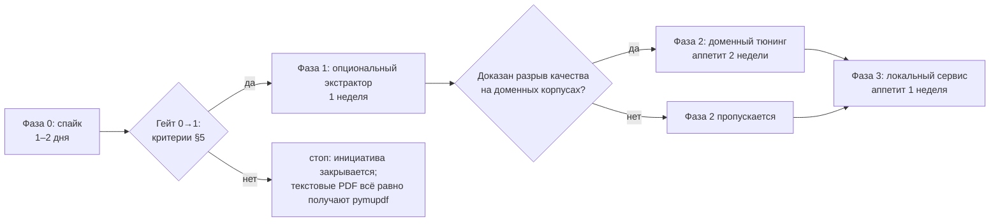
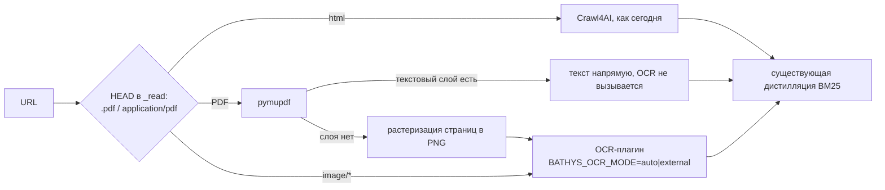

# Инициатива: OCR-чтение PDF, сканов и скриншотов

| Поле | Значение |
|---|---|
| Статус | Приостановлена (решение мейнтейнера 2026-09-06: приоритет — доступность на любом CPU-железе); ранее: спайк одобрен председателем 2026-09-06; интеграция при разморозке — отдельное решение архкома по критериям §5 |
| Дата | 2026-09-06 |
| Мейнтейнер | единственный |
| База-кандидат | GLM-OCR (`zai-org/GLM-OCR`, HuggingFace) |
| Смежные документы | [charter.md](charter.md) · [roadmap.md](roadmap.md) · [features.md](features.md) · [ADR 0004](../adr/0004-bm25-distillation.md) |

## 1. Зачем: единственная модальная дыра

Сегодня Bathys читает только HTML: `read_url` рендерит страницу через Crawl4AI и
дистиллирует текст. Три класса источников из реального ресёрча выпадают целиком:

| Источник | Что происходит сегодня | Ожидание |
|---|---|---|
| Текстовый PDF (статьи, документация, отчёты) | Crawl4AI слаб на PDF: агент получает мусор или ошибку | Чистый текст через `pymupdf` (text-layer) |
| Сканы и фото документов | Не читаются вовсе | Текст через OCR |
| Скриншоты кода, таблиц, терминала | Не читаются вовсе | Текст через OCR |

Это единственная модальная дыра продукта: поиск, HTML-чтение, дистилляция и кэш
закрыты; всё, что не HTML, — нет. Закрывается она не параллельным продуктом, а
адаптером источника: OCR-текст течёт через существующие `slim_markdown` + BM25
(см. [ADR 0004](../adr/0004-bm25-distillation.md)) и попадает под главную метрику
сжатия хартии.

JTBD-кандидат: «Когда в ресёрче попадается PDF или скриншот, я хочу получить его
текст тем же `read_url`, чтобы не вываливаться из локального конвейера в облачные
vision-инструменты».

## 2. Рамка: экстрактор, не синтез

Хартия (принцип 2) запрещает LLM внутри Bathys; [Not-doing](roadmap.md) запрещает
локальную LLM. Формально GLM-OCR — VLM (1,33 млрд параметров), поэтому буквальное
прочтение запрета убивает инициативу. Рамка предложения различает назначение модели:

- **Синтез — нет.** Дистилляция, ранжирование, выводы и multi-hop остаются
  детерминированными и без моделей. Поправка не трогает ADR 0004: OCR стоит
  до дистилляции, не внутри неё.
- **Узкие экстракторы — да, как опциональные плагины.** Перевод модальности в текст
  (OCR, в перспективе ASR) при жёстких условиях: пин версии весов, greedy-декодинг,
  нет доступа к диалогу и инструкциям, выключено по умолчанию. Модель трактуется
  как кодек «картинка → текст», а не как собеседник.

Драфт поправки к хартии: «генеративные модели для синтеза — нет; узкие
модели-экстракторы как опциональные плагины — да». Поправка требует формального
ревью хартии по итогам спайка и до старта Фазы 1; решение фиксируется отдельным
ADR (`docs/adr/0007-*.md`, файл пока не создан). До ревью инициатива не получает
доступа к кодовой базе.

## 3. База-кандидат: почему GLM-OCR

Факты проверены 2026-09-06. GLM-OCR: заявлено 0,9 млрд параметров, фактически
1,33 млрд (BF16, ~2,65 ГБ safetensors: декодер GLM-0.5B + CogViT-энкодер +
коннектор); №1 OmniDocBench V1.5 (94.62), вход PDF (≤ 50 МБ, ≤ 100 стр.) и
изображения (≤ 10 МБ), выход Markdown / HTML-таблицы / JSON, русский
поддерживается, веса открыты (`zai-org/GLM-OCR` на HuggingFace). Рантайм:
поддержка влита в llama.cpp (GGUF + mmproj, PR #19677) — это путь архкома;
vLLM/SGLang CPU-режимы отклонены (nightly-зависимости × экспериментальный
multimodal-on-CPU × невоспроизводимость без apt). API Z.ai существует
($0.03/M токенов), но решением мейнтейнера (уточнение 2026-09-06) **исключён
из планов**: основа — открытые веса, своя модель поверх, всё локально.
Лицензия весов **не подтверждена** — ожидаемо MIT по традиции GLM-семейства;
проверка вынесена в спайк (критерий 5 из §5).

| Кандидат | Сильное | Слабое | Вердикт |
|---|---|---|---|
| `pymupdf` (pip-only) | мгновенный и точный на текстовых PDF, ставится без apt (poppler в среде недоступен) | не OCR: на сканах пусто | обязательный первый путь для PDF, вне конкуренции |
| `tesseract` (rus+eng) | классический CPU-OCR, бесплатный | слаб на макетах, таблицах, коде | база сравнения качества в спайке |
| Crawl4AI-браузер | уже в стеке | на PDF слаб, картинки не читает | замер в спайке фиксирует статус-кво |
| GLM-OCR | топ качества, малый размер (реалистичен для CPU), русский, экосистема Z.ai для кросс-чека | лицензия не подтверждена; CPU-латентность неизвестна | база-кандидат для OCR-ветки |
| Qwen-VL (2B+), PaddleOCR-VL, olmOCR и др. | сильные альтернативы | тяжелее для CPU и/или слабее на русском | запасной список баз при провале лицензии или латентности |

Выбор базы — не вера, а гипотеза для спайка: если лицензия не подтвердится или
CPU-латентность провалит гейт, спайк возвращает проект к запасному списку.

## 4. Роадмап по фазам с гейтами

Ёмкость — один мейнтейнер в вечернем режиме; ниже аппетиты (time-box), а не
оценки. Каждая фаза начинается только после гейта предыдущей.

- После гейта 0→1 архком может пропустить Фазу 2 и перейти к Фазе 3: тюнинг не
  обязателен для интеграции.
- `STOP` — тоже валидный исход: даже при отказе от OCR вывод «текстовые PDF →
  `pymupdf`» остаётся полезным сам по себе.

### Фаза 0 «Спайк» (1–2 дня, вне кодовой базы)

Цель — превратить «верю в GLM-OCR» в таблицу чисел. Содержание: проверка лицензии;
сбор трёх корпусов по 5 документов (текстовый PDF, скан, скриншот кода) с ручными
эталонами; прогон кандидатов (`pymupdf`, Crawl4AI-браузер, `tesseract`, GLM-OCR —
только локально: llama.cpp + GGUF; API исключён мейнтейнером); заполнение таблицы
«качество × латентность × память». Кода в `src/bathys` не пишется — приоритеты
v0.2 P0 не затрагиваются. Чеклист — §7.

### Фаза 1 «Опциональный экстрактор» (1 неделя, только при пройденном гейте)

Ветка конвейера по content-type:

- Детектор текстового слоя: `pymupdf` на первой странице дал ≥ 200 символов →
  текстовый путь, OCR не вызывается.
- Ветка живёт в `core.py::_read` до вызова Crawl4AI (дешёвый HEAD: расширение
  `.pdf` или `Content-Type: application/pdf`) — прозрачно и для `research()`.
- Новый optional extra `[vision]`: веса и runtime OCR не попадают в
  core-зависимости; скачивание весов — явное действие пользователя.
- Режимы `BATHYS_OCR_MODE=off|auto|external`, дефолт `off`; `external` — чужой
  уже поднятый `llama-server` по `BATHYS_OCR_URL`; `auto` — свой дочерний процесс
  по образцу нативного SearXNG (health-check, лог-файл, lifecycle в `Engine.stop`).
- `BATHYS_OCR_HOME` — каталог весов: GGUF + mmproj скачиваются туда по curl
  явным действием пользователя (в Фазе 1 — вручную, автодокачка — Фаза 3).
- Отдельный таймаут OCR ~300 с (не `crawl_timeout` = 40 с — иначе один скан
  уложит дайв) и собственный семафор (1): параллельные нырки в OCR очередяются,
  CPU не трэшится; сетевой семафор (4) с OCR-стадией не делится.
- В `deep_research` сканы в дайве не читаются: возвращается пометка
  «(not fetched — scanned PDF, use read_url)» — дайв не блокируется, полное
  чтение делается отдельным `read_url` со своим таймаутом.
- Кэш OCR — по хэшу тела документа (URL не гарантирует содержимое),
  `BATHYS_OCR_TTL` ~30 дней: результат детерминирован, страница-в-минуту не
  должна считаться дважды.
- OCR-результат кэшируется как сырец (расширение [F-004](features.md)); повторное
  чтение бесплатно, пере-дистилляция под новый запрос не трогает модель.
- Метрики ветки: доля документов, ушедших в OCR; латентность; выборочный CER
  на эталонах.

### Фаза 2 «Доменный тюнинг» (аппетит 2 недели, только при доказанном разрыве)

Триггер: на реальных материалах мейнтейнера базовая модель систематически проваливает
класс документов — разрыв ≥ 10 п.п. по точности символов на ≥ 20% документов домена
либо недопустимо плохой класс «таблицы / рукописное / код». Состав: датасет из
материалов мейнтейнера (200–500 страниц с эталонами — самая дорогая часть работы),
LoRA-дообучение, eval-набор и регресс-гейт: тюнутая модель не хуже базовой на общем
eval и лучше на доменном, иначе остаёмся на базовой. Явная цена: обучение требует
GPU — внешнего или арендованного; это осознанный выход за «всё локально», бюджет
определяет мейнтейнер до старта фазы.

### Фаза 3 «Вшить намертво» (аппетит 1 неделя)

Локальный сервис модели как дочерний процесс — lifecycle зеркало `_Native` из
`services.py` (по образцу нативного режима SearXNG, [F-005](features.md)):
автоподъём при `BATHYS_OCR_MODE=auto`, релизный бинарник `llama-server` под
linux-x64 (пин версии), веса GGUF/mmproj докачиваются по curl в
`BATHYS_OCR_HOME`, автоопределение режима CPU/GPU, документация. «Вшить»
означает отсутствие ручных шагов установки при включении, а не смену дефолта:
`BATHYS_OCR_MODE=off` остаётся дефолтом до
отдельного решения архкома. Документация пишется в `docs/getting-started` (чужая
зона относительно этого файла) — размещение согласуется отдельно.

## 5. Критерии гейта интеграции

Гейт 0→1 пройден, когда выполнены все шесть пунктов; каждый проверяем:

1. **Роутинг.** Каждый PDF с текстовым слоем идёт через text-layer (`pymupdf`); на корпусе A
   спайка ноль документов уходит в OCR (проверка по журналу ветки конвейера).
2. **Латентность.** Локальный CPU-инференс: p50 ≤ 5 мин на документ ≤ 5 страниц для
   одиночного `read_url` на целевой машине (16 ядер CPU, 30 ГБ RAM, квантованные
   GGUF-веса; оценка системного инженера: 0,5–2 мин на плотную страницу). Значение
   измерено в спайке, не оценено; порог зафиксирован до измерений и после — не двигается.
3. **Качество.** На корпусе сканов: точность символов (1 − CER, character error
   rate) ≥ 0,95 по медиане и ≥ `tesseract` + 10 п.п.; на корпусе скриншотов кода:
   извлечённый текст проходит синтаксический парсер соответствующего языка там, где
   `tesseract` даёт невалидный.
4. **Упаковка.** Веса опциональны (`[vision]` extra, не core-зависимости),
   `BATHYS_OCR_MODE=off` по умолчанию, скачивание весов — явное действие.
5. **Лицензия.** `LICENSE` репозитория `zai-org/GLM-OCR` прочитан и подтверждён
   как совместимый (факт, не ожидание); тип лицензии зафиксирован в этом документе.
6. **Приоритеты.** v0.2 P0 — фикс `_tok`, пины SearXNG, `secs` в футерах — не
   сдвинуты: Фаза 1 стартует только после их приземления.

Порог «заметно лучше `tesseract`» в пункте 3 операционализирован как +10 п.п.
точности символов. Если архком хочет другой порог — он меняется до гейт-решения,
не после.

## 6. Риски и альтернативы

| Риск | Почему важно | Ответ |
|---|---|---|
| Лицензия весов не подтвердится | интеграция с неясной лицензией — юридическая мина | критерий 5 §5; при провале — базы из запасного списка §3 |
| CPU-латентность выше гейта (5 мин / ≤ 5 стр.) | `read_url` деградирует, агент уйдёт в таймаут — токен-экономика обесценится | критерий 2 §5; отдельный таймаут ~300 с и семафор (1); при провале OCR остаётся только в `deep_research` фоново либо закрывается |
| RAM 30 ГБ: Chromium + SearXNG + модель одновременно | деградирует весь стек, а не только OCR | замер RSS в спайке; последовательный запуск; выгрузка модели по таймауту неактивности |
| Облако Z.ai | платный облачный сервис против принципа «ноль облаков» и приватности | исключено мейнтейнером (2026-09-06): только открытые веса, всё локально; API-путей в роадмапе нет |
| Фаза 2 утянет в ML-работу | аппетит проекта — вечера; датасеты, LoRA и eval — отдельная профессия | фаза открывается только по триггеру-условию; GPU внешний; регресс-гейт обязателен |
| Обновления весов апстримом | тихий регресс качества после обновления | пин версии весов; eval-набор — обязательная проверка при каждом обновлении |
| Дрейф хартии по прецеденту | «одну модель вшили — вшьём и вторую» | поправка §2 сформулирована узко (экстракторы-плагины); любое расширение — новое ревью хартии |

## 7. Чеклист спайка (Фаза 0)

Пороги для всех замеров берутся из §5; по ходу спайка они не меняются.

Подготовка:

- [ ] Прочитан `LICENSE` репозитория `zai-org/GLM-OCR`; тип лицензии записан в §3
      как факт.
- [ ] Корпус A собран: 5 текстовых PDF (статьи, документация; RU+EN).
- [ ] Корпус B собран: 10 собственных страниц мейнтейнера (сканы/фото: RU-текст,
      таблицы, формулы).
- [ ] Корпус C собран: 5 скриншотов кода и терминала.
- [ ] Ручные эталоны (ground truth) набиты для корпусов B и C.
- [ ] Формулы из корпуса B помечены как отдельный класс отчёта: их CER считается
      отдельно и на гейт §5 не влияет.

Замеры:

- [ ] `pymupdf` (text-layer) прогнан на корпусе A: доля осмысленного текста,
      секундомер.
- [ ] Crawl4AI-браузер прогнан на корпусе A: зафиксировано текущее поведение
      (мусор / ошибка / что-то осмысленное).
- [ ] `tesseract` (rus+eng) прогнан на корпусах B и C: CER по эталонам, секундомер.
- [ ] GLM-OCR локально поднят через llama.cpp + GGUF (релизный `llama-server`
      под linux-x64, mmproj из репозитория весов; vLLM/SGLang отклонены архкомом);
      совместимость mmproj-состава GGUF проверена до локальных замеров:
      CER по эталонам на A/B/C, латентность на документ ≤ 5 страниц, сек/страницу,
      RSS процесса — на 16 ядрах без GPU.
- [ ] Таблица «кандидат × качество × латентность × память» заполнена.

Решение:

- [ ] По каждому критерию §5 записан вердикт «да/нет» с числом.
- [ ] Вывод спайка дописан в этот документ новой секцией «Результаты спайка».
- [ ] Архком собран; гейт-решение записано; статус документа обновлён.

## 8. Приостановка и триггеры возврата

Приостановлена решением мейнтейнера 2026-09-06: приоритет отдан доступности Bathys
на любом CPU-железе. Ожидаемая CPU-латентность класса (оценка системного
инженера: 0,5–2 мин на плотную страницу, §5) и вес модели (1,33 млрд параметров)
несовместимы с этим приоритетом: `read_url` с OCR-веткой деградирует на том
железе, где MCP обязан просто работать. Содержимое §1–§7 не пересматривалось и
остаётся готовым к разморозке без переработки.

Триггеры возврата (достаточно любого):

- у мейнтейнера появляется GPU — латентностный критерий §5 перестаёт быть блокером;
- подтверждённый спрос на сканы/формулы после недели реального использования —
  класс источников встречается в живом ресёрче достаточно часто, чтобы платить
  за него латентностью.

При срабатывании триггера документ размораживается как есть; спайк стартует по
чеклисту §7. До этого момента инициатива не получает доступа к кодовой базе (см.
§2); место в роадмапе-кандидатах занято mind-инициативой
([mind-initiative.md](mind-initiative.md)).
